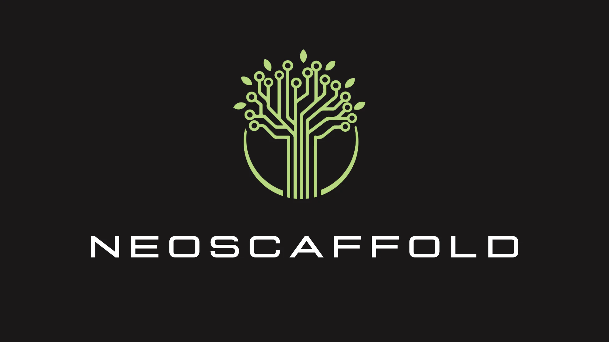

<div align="center">
  <!-- Version Badge -->
  <a href='https://github.com/neoscaffold/neoscaffold/releases'>
    
  </a>
  <!-- Chat Badge -->
  <a href='https://discord.gg/fWncYRBY'>
    
  </a>
  <!-- Docs Badge -->
  <a href=''>
    
  </a>
  <!-- Precommit Badge -->
  <a href='https://github.com/neoscaffold/neoscaffold/blob/main/.pre-commit-config.yaml'>
    
  </a>
</div>

<h1 align="center">
  
</h1>

NeoScaffold let's you visually program workflows for ai agents and more.

You can import, edit, and export workflows for:
  - building trustworthy and safe ai use-cases
  - iterating quickly on new ideas

Version 0.2.0 adds parallel graph execution for async-friendly workflows, including UI execution mode controls, async node evaluation, and control-flow support that completes `IfEqual` and `WhileLoop` graphs through their `End*` nodes while only running the selected branch/body path.


## Table of Contents

<details open="open">
  <summary>Table of Contents</summary>
  <ol>
    <li><a href="#backstory"> ➤ Backstory 📖🐉</a></li>
    <li><a href="#installation"> ➤ Installation 💿</a></li>
    <li>
      <a href="#fun-with-neoscaffold"> ➤ Fun With NeoScaffold 🎨</a>
      <ul>
        <li><a href="#building-an-ai-persona-agent"> ➤ Building an AI Persona Agent 🕴️</a></li>
        <li><a href="#custom-extensions-for-more-nodes"> ➤ Custom Extensions for More Nodes 🧩</a></li>
        <li><a href="#rules-for-reliable-quality"> ➤ Rules for Reliable Quality 🔍</a></li>
      </ul>
    </li>
    <li><a href="#contributing-directly"> ➤ Contributing Directly 🤝</a></li>
    <li><a href="#issues"> ➤ Issues 🐛</a></li>
    <li><a href="#faq"> ➤ FAQ 🤔</a></li>
    <li><a href="#changelog"> ➤ Changelog 📜</a></li>
    <li><a href="#contributors"> ➤ Contributors 🤝</a></li>
    <li><a href="#license"> ➤ License 📄</a></li>
    <li><a href="#views"> ➤ Views 👀</a></li>
  </ol>
</details>


## Backstory

[ComfyUI](https://github.com/comfyanonymous/ComfyUI) provided us a new way to build ai inference workflows to create images, and animations. Now, we don't need to write code to setup the inference pipelines, instead we visually program using nodes. Sleepless nights are now spent creating amazing art and pipelines to breath life to our work.


NeoScaffold aims to do same to many more workflows.


Emphasizing the following more:
  - Friendly development experience
  - No-compromises support for runtime quality checks on node inputs or node outputs
  - [litegraph.js](https://github.com/jagenjo/litegraph.js) sharing ComfyUI's front-end graph engine


## Installation

First Git clone this repo.

NeoScaffold requires using at least node 18 and python 3.10.

To setup python 3.10 we recommend [uv](https://docs.astral.sh/uv/concepts/python-versions/#installing-a-python-version) or [pyenv](https://github.com/pyenv/pyenv#readme).


To get the backend up and running use uv:

```bash
# change to server folder
cd server;

# make sure there's a virtual environment
uv venv;

# activate it
source .venv/bin/activate;

# install the dependencies
uv sync;

# run the server
python main.py;

# optionally run the server with delay to watch the output of the nodes
python main.py --inspection-delay 1;

# optionally run prompts with the parallel graph executor by default
python main.py --enable-parallel-execution --max-parallel-nodes 8;
```

To get the front-end server running:

We recommend using a node version manager like [nvm](https://github.com/nvm-sh/nvm) to install node 18 if you don't already have it.

Our example front-end uses [Ember.js CLI](https://cli.emberjs.com/release/) version [5.8](https://blog.emberjs.com/ember-released-5-8/)

```bash
# Change to the frontend directory
cd neoscaffold;

# Use Node.js version 18
nvm use 18;

# to get ember-cli globally
npm i --global ember-cli@5.8

# Install dependencies using clean-install
npm ci;

# Start the front-end server
npm start;
```


## Fun With NeoScaffold

NeoScaffold can be a colorful and fun way to build workflows. You can use existing nodes, or create your own.


### Building an AI Persona Agent

#### TODO: Add a gif of the persona agent
#### TODO: add a step by step guide to building the persona agent


### Custom Extensions for More Nodes

NeoScaffold provides a way to create extensions that give developers a way to add new nodes to the graph. Their core functionality is defined in python, however the user can provide a non-default litegraph.js "node" to customize the node's appearance in the graph.

Extensions are defined in python with a simple dict-interface like this included in a ```extension.py``` file:

```python
# in server/custom_extensions/image_utilities/extension.py

# Example Node
class PreviewImageURL:
    # LABELS
    CATEGORY = "images"
    SUBCATEGORY = "image"
    DESCRIPTION = "preview image url"

    # INPUT TYPES
    INPUT = {
        "required_inputs": {
            "url": {
                "kind": "*",
                "name": "url",
                "widget": {"kind": "string", "name": "url", "default": ""},
            },
        }
    }

    # OUTPUT TYPES
    OUTPUT = {
        "kind": "RESPONSE",
        "name": "RESPONSE",
        "cacheable": True,
    }

    # METHODS
    def evaluate(self, node_inputs):
        self.url = node_inputs.get("required_inputs").get("url").get("values")
        return self.url

# Example Extension
EXTENSION_MAPPINGS = {
    "name": "ImageUtilities",
    "version": version,
    "description": "Extension for additional image nodes",
    "javascript_class_name": "ImageUtilities",
    "nodes": {
        "PreviewImageURL": {
            "python_class": PreviewImageURL,
            "javascript_class_name": "PreviewImageURL",
            "display_name": "PreviewImageURL",
        },
    },
    "rules": {},
}

```


### Rules for Reliable Quality

#### TODO: Add a gif of the rules in action
#### TODO: add a step by step guide to building the rules


## Contributing Directly

See [CONTRIBUTING.md](https://github.com/neoscaffold/neoscaffold/blob/main/CONTRIBUTING.md)


## Issues

We ask our users to create issues if they see a bug, or would like to request a feature from the team.

If you have a question or concern please feel free to reach out on the respective team's channel and we will help you usually within the business day.


## FAQ

See [FAQ.md](https://github.com/neoscaffold/neoscaffold/blob/main/FAQ.md)


## Changelog

See [CHANGELOG.md](https://github.com/neoscaffold/neoscaffold/blob/main/CHANGELOG.md)


## Author

Conrad Lippert-Zajaczkowski


## License

This project is Apache 2.0 licensed.


## Views


